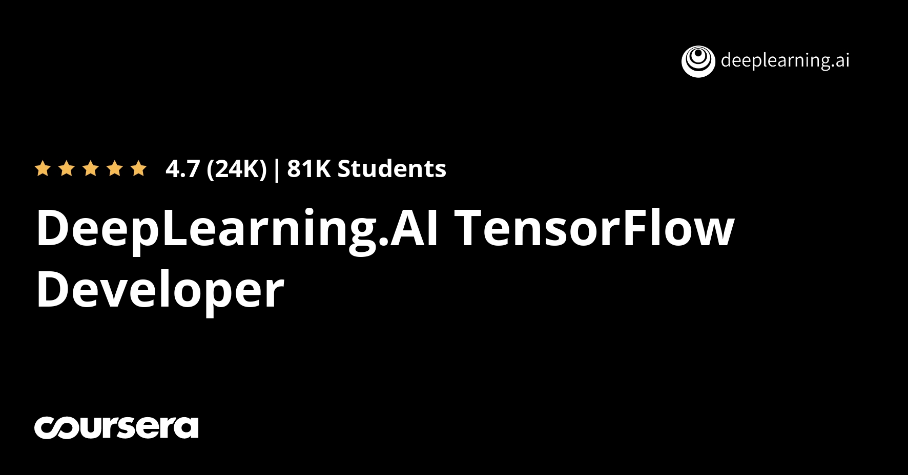

# Tensorflow
> This Repository will hold my takeaways as I continue to learn about tensorflow from various sources. Currently I am doing my first course on tensorflow,one offered by DeepLearning.ai in Coursera. 

## Courses covered
* [Introduction to TensorFlow for Artificial Intelligence, Machine Learning, and Deep Learning](https://www.coursera.org/learn/introduction-tensorflow)

## Screenshots

